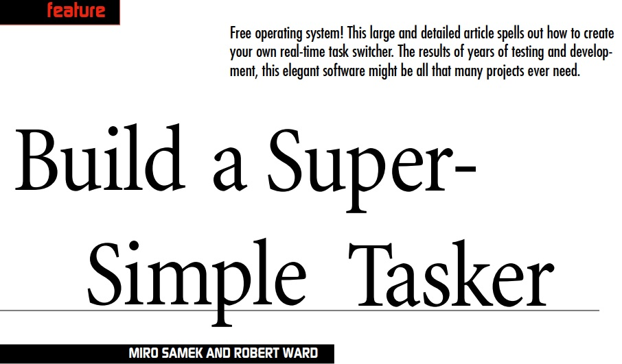

[](Super-Simple-Tasker.pdf)


# Build a Super Simple Tasker

## Miro Samek and Robert Ward
## July, 2006

["Build a Super-Simple Tasker"](Super-Simple-Tasker.pdf) was
a cover story article published originally in
[Embedded Systems Programming](https://www.embedded.com/build-a-super-simple-tasker)
magazine in July 2006. This repository contains the article PDF and the updated code.


# Licensing
The SST source code and examples are released under the terms of the GNU
General Public License version 2 (GPL) as published by the Free Software
Foundation and appearing in the file LICENSE included in this repository.
Please note that GPL Section 2[b] requires that all works based on this
software must also be made publicly available under the terms of the GPL
("Copyleft").


# Files and Directories
The <sst> code repository the following subdirectories and files:

```
<sst>\
  |
  +-README.md        - this file
  |
  +-LICENSE          - the GNU General Public License
  |
  +-example\         - subdirectory containing the SST example files
  | |
  | +-bin\           - contains .OBJ, .EXE, and .MAP files
  | +-bsp.c          - Board Support Package for DOS/Turbo C++ 1.01
  | +-bsp.h          - BSP header file
  | +-kbd_task.c     - The keyboard task function
  | +-main.c         - The main function
  | +-sst_exa.h      - The header file for the SST example application
  | +-sst_exa.prj    - The Turbo C++ project file for building and
  | |                  debugging the SST example application from the
  | |                  Turbo C++ IDE
  | +-sst_port.h     - SST port to DOS/Turbo C++ 1.01
  | +-stdint.h       - The C99 standard exact-width integer types
  | |                  for the Turbo C++ 1.01, which is a pre-standard
  | |                  compiler. You could copy this file to the
  | |                  Turbo C++ include directory.
  | +-tick_tsk.c     - The two tick tasks (tickTaskA and tickTaskB)
  |
  +-include\         - subdirectory containing the SST public interface
  | +-sst.h          - The platform-independent SST header file
  |
  +-source\          - subdirectory containing the SST implementation
    +-sst.c          - platform-independent SST implementation
```

# Running the SST Example
The executable file for the SST example is provided in
<sst>\example\bin\sst_exa.exe. You can run this executable on any
Windows-based PC in a DOS-console by simply double-clicking on the executable.
However, the program takes one command-line argument, which is easiest to
provide by launching the program from a command prompt.

The command-line argument determines the number of iterations through a delay
loop peppered throughout the application code. The purpose of this delay is to
extend the run-to-completion processing (which is really short on the fast
modern PCs), and thus increase the probability of asynchronous preemptions.
We’ve been using a typical value of this delay around 10000 on a modern 2GHz
PC, which corresponds to the following invocation of the SST example
application:

`sst_exa.exe 10000`

As described in the article, you should not go overboard with this parameter
because you can eventually overload the machine, and the SST will start losing
events (the queues will overflow and won’t accept new events).

Once the application starts running, you can generate asynchronous preemptions
by typing on the keyboard. The keyboard interrupt is asynchronous with respect
to the periodic time-tick interrupt and consequently the keyboard interrupt
can preempt the time tick tasks (that run just after the tick interrupt), and
the time tick interrupt can preempt the keyboard task (that runs just after
the keyboard interrupt). Moreover, the interrupts can also preempt each other.
Please note, however, that the tick ISR has the highest priority, and
consequently the Programmable Interrupt Controller (the 8259A chip) will not
allow in hardware that the lower-priority keyboard ISR preempts the
highest-priority tick ISR. The only allowed interrupt preemption is that tick
ISR preempts the keyboard ISR. You should verify this by observing the
“Preemptions” column of the application display.

After typing for a while on the keyboard, you should see some cases of the
asynchronous preemption in the “Preemptions” column. The synchronous
preemptions are not displayed, but they occur every time a keyboard task posts
an event to the higher-priority tickTaskB(). On the other hand, the
synchronous preemption does not occur when the keyboard task posts an event to
the lower-priority tickTaskA().


# Borland Turbo C++ 1.01
In order to modify and recompile the example, you need to download and install
the legacy Turbo C++ 1.01 compiler, which is available for a free download
from the Borland Museum at
http://bdn.borland.com/article/0,1410,21751,00.html.

The legacy DOS platform has been chosen for demonstrating SST because it still
allows programming with interrupts, directly manipulating CPU registers, and
directly accessing I/O space of the processor (required for writing the EOI
command to the 8259A interrupt controller). No other desktop 32-bit
development environment for the commodity PC allows this much so easily. The
ubiquitous PC running under DOS (or a DOS console within any variant of
Windows) is capable of demonstrating most key embedded features of SST.

To install Borland Turbo C++ 1.01, download the file TCPP101.ZIP from the
Borland Museum and unzip it into a temporary directory. Run the INSTALL.EXE
program and follow the installation instructions.


-------------------------------------------------------------------------------
# Integrating SST with State Machines
As described in the article, SST-type kernel is ideal for deterministic
Run-To-Completion (RTC) execution of concurrent state machines. The website
https://www.state-machine.com provides an implementation of the RTC kernel, called
**QK** ("Quantum Kernel") that works exactly like SST and only differs in the way it
is integrated with the state-machine event processor (QEP) and the state
machine framework (QF). QK has been ported to many embedded CPUs, such as:
**ARM Cortex-M** (M0-M7), MSP430, PIC24/dsPIC, PIC32, etc.

Miro Samek

April 24, 2006
